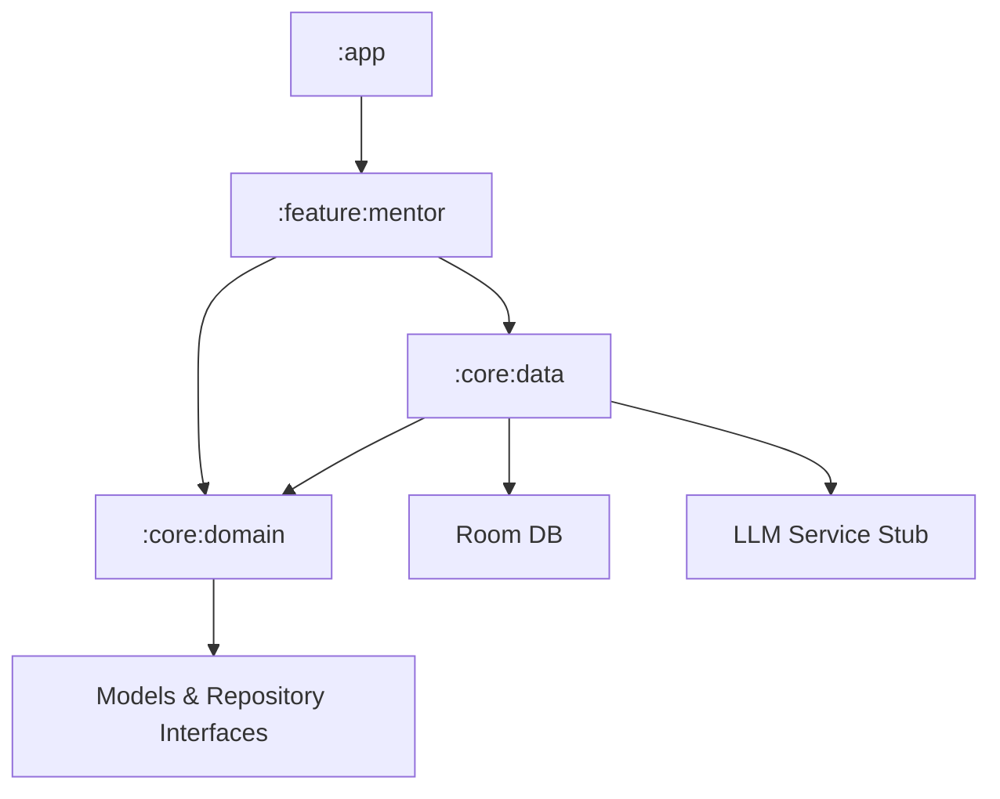

# S&S Neural Mentor

**A high-performance Android portfolio showcase featuring dual-personality AI mentorship, sophisticated prompt engineering workflows, and a robust Clean Architecture implementation designed for on-device LLM readiness.**

---

## 📸 Screenshots & Demo

| Mentor Selection | Chat Interface (Sara - Golden Hour) | Chat Interface (Soodeh - Liquid Fire) |
| :---: | :---: | :---: |
|  |  |  |

> *Note: Visuals demonstrate dynamic Material 3 theme switching and custom personality-driven UI components.*

---

## 🚀 Features

*   ✅ **Dual AI Personas:** Experience two distinct mentorship styles—Sara Irani (Authoritative Prompt Architect) and Soodeh Irani (Sarcastic AI Rebel).
*   ✅ **Dynamic Contextual Theming:** Real-time Material 3 theme switching that adapts colors, shapes, and animations based on the active mentor's personality.
*   ✅ **Advanced Prompt Engineering:** Specialized modes for generating "Russian Prompting Technique" (Sara) and "Zero-Filter Code Hacks" (Soodeh).
*   ✅ **Local Persistence:** Full chat history management powered by **Room Database** for offline-first reliability.
*   ✅ **Type-Safe Navigation:** Modern navigation stack utilizing Kotlin Serialization for safe argument passing between screens.
*   ✅ **Clean Architecture:** Strict multi-module separation (`:app`, `:feature`, `:domain`, `:core`) ensuring scalability and testability.
*   ✅ **Reactive State Management:** Unidirectional Data Flow (UDF) powered by `StateFlow` and `collectAsStateWithLifecycle`.
*   ✅ **Production-Grade UI/UX:** Smooth animations, custom typing indicators, and clipboard integration for generated prompts.
*   ✅ **Export & Sharing:** One-tap export of chat histories in Markdown-compatible formats via Android's Share Sheet.
*   ✅ **AI-Ready Infrastructure:** Pluggable `LLMService` architecture designed for seamless future integration with **Gemini Nano** or **MediaPipe**.

---

## 🛠 Technical Stack

| Category | Technology |
| :--- | :--- |
| **Language** | Kotlin 2.1.0+ |
| **UI Framework** | Jetpack Compose (Material 3) |
| **Architecture** | Clean Architecture (Domain, Data, UI) |
| **Navigation** | Navigation Compose (Type-safe routes) |
| **Database** | Room Persistence Library |
| **Concurrency** | Kotlin Coroutines & Flow |
| **Serialization** | Kotlinx Serialization |
| **Performance** | Baseline Profiles & R8 Optimization |

---

## 🏗 Architecture

The project follows the **Clean Architecture** pattern to maintain a clear separation of concerns, facilitating easy maintenance and future technology swaps (e.g., migrating from Fake LLM to Gemini Nano).



*   **`:feature:mentor`**: Contains the UI logic, ViewModels, and Compose screens.
*   **`:core:domain`**: Business logic, use cases (mentorship rules), and repository interfaces.
*   **`:core:data`**: Implementation of repositories, local data sources (Room), and LLM service stubs.
*   **`:core:common`**: Shared UI components, themes, and utility functions.

---

## 🛠 Getting Started

### Prerequisites
*   Android Studio **Koala** (2024.1.1) or newer.
*   JDK 17 or higher.
*   An Android device or emulator running API 26 (Android 8.0) or higher.

### Build & Run
1.  **Clone the repository:**
    ```bash
    git clone https://github.com/yourusername/SSNeuralMentor.git
    ```
2.  **Open the project** in Android Studio.
3.  **Gradle Sync:** Wait for the project to sync dependencies.
4.  **Run:** Click the "Run" button or use `./gradlew assembleDebug` to build the APK.

---

## 🗺 Roadmap

*   [ ] **On-Device LLM Integration:** Migrate from stubs to real **Gemini Nano** via AICore or MediaPipe LLM Inference.
*   [ ] **Voice Interaction:** Integrate Speech-to-Text and TTS with personality-specific voice profiles.
*   [ ] **Prompt Template Library:** Allow users to save and categorize generated "Russian Prompts."
*   [ ] **RAG Workbench:** Add a module for users to upload documents to provide context for the AI mentors.
*   [ ] **Advanced Analytics:** Visualize prompt optimization improvements over time.

---

## 📄 License

Copyright 2024 S&S Neural Mentor

Licensed under the Apache License, Version 2.0 (the "License");
you may not use this file except in compliance with the License.
You may obtain a copy of the License at

    http://www.apache.org/licenses/LICENSE-2.0

Unless required by applicable law or agreed to in writing, software
distributed under the License is distributed on an "AS IS" BASIS,
WITHOUT WARRANTIES OR CONDITIONS OF ANY KIND, either express or implied.
See the License for the specific language governing permissions and
limitations under the License.

---

## 👤 Author

**Rashid**  
*Senior Android Developer & AI Enthusiast*

*   [GitHub](https://github.com/yourusername)
*   [LinkedIn](https://linkedin.com/in/yourprofile)
*   [Portfolio](https://yourportfolio.com)

[README.md für S&S Neural Mentor wurde generiert – bereit zum Commit]
